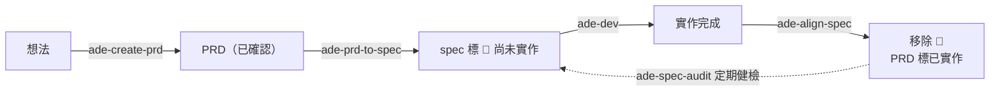

# create-agentic-dev-env

> 為團隊打造 **Agentic Dev Environment（ADE）**：一個集中管理跨服務知識、產品規格與開發方法的知識庫 repo，一行指令注入到每個人的 Claude Code，讓全隊的 agent 用同一套上下文、同一套做事流程——團隊的知識從「散落在成員腦中」變成「持久化、可迭代的資產」。

## 這是在解決什麼

團隊有多個服務、多個 repo。每次要 agent 幫忙，都得重講一次「我們有哪些服務」「這功能的規格長怎樣」「我們的 commit 和 MR 怎麼寫」——講過的下次還要再講，每個人講的版本都不太一樣；文件寫了也沒人維護，半年後沒人敢信。

本工具生成並維護一種 repo（**ADE repo**）來把這兩件事抽出來共用：

- **知識**（`knowledge/`）— 服務 registry、跨服務流程慣例、產品規格與 PRD。agent 需要時自己去讀，不用人轉述。
- **方法**（`skills/`）— 十六支 `ade-*` skill，把「怎麼開需求、怎麼開發、怎麼交付、怎麼維護文件」寫成 agent 照著跑的流程。

再加一條讓它不會腐爛的機制：工作目錄裡的知識是**唯讀副本**，agent 用的過程中發現內容與現實不符，會**當場開 PR 修回來**，人只需要 review。

**導覽**：[快速上手](#快速上手) · [核心概念](#核心概念) · [Skills](#skills) · [本 repo 結構](#本-repo-結構) · [版本與相容性](#版本與相容性) · [開發與發版](#開發與發版)

---

## 快速上手

### 先認識三個地方

| | 是什麼 | 誰在動它 |
| --- | --- | --- |
| **本 repo**（create-agentic-dev-env） | 腳手架（`create`）＋執行期 runner（`init`／`update`），發佈到 npm | 框架維護者；各 ADE repo 以 issue 回饋機制改良 |
| **ADE repo** | `create` 生成、每個團隊一份的知識庫 repo，團隊知識與 skills 的**唯一真相來源** | 團隊一律走 PR（agent 端由 `ade-contribute` 引導） |
| **工作目錄**（hub） | 成員電腦上的一個資料夾，**開 Claude Code 的起點**。裡面有 ADE 的唯讀副本＋全部 skills，底下的 `workspaces/` 放實際要開發的服務 repo | 副本不要手改（update 會整個覆蓋）；`workspaces/` 下的服務 repo 照平常方式開發 |

### 步驟 1：建立你的 ADE repo

```sh
pnpm dlx create-agentic-dev-env my-ade
```

生成的 `my-ade/` 帶完整結構、十六支 skills、一份給團隊讀的 README（安裝步驟、核心概念、場景速查、逐支 skill 詳解都在裡面）。接著：

1. 填 `my-ade/package.json` 的 `repository.url`——放 GitHub／GitLab 填 git url；只在本地填絕對路徑（見[本地模式](#本地模式ade-repo-不放-githubgitlab)）
2. `git add -A && git commit`（init／update 都從 commit 取內容，沒有 commit 會被擋下），放 GitHub／GitLab 的再 push
3. 在 `my-ade/` 開 Claude Code，說「新增服務」（`ade-add-service`）開始填 `knowledge/`

### 步驟 2：團隊成員安裝

每人挑一個空目錄當工作目錄（一台機器一個就夠），在裡面執行：

```sh
pnpm dlx "git+ssh://git@github.com/ORG/my-ade.git" init                      # SSH 設定見生成的 README
pnpm dlx "git+ssh://git@github.com/ORG/my-ade.git" init --workspaces ~/projects   # 沿用既有 repo 資料夾（symlink）
```

init 在當前目錄建立：

```
work-dir/
├── CLAUDE.md             # 原有內容不動，插入 <!-- ADE:BEGIN/END --> managed 區段
├── .ade.json             # source、commit（新鮮度檢查用）、workspaces 位置
├── .claude/
│   ├── ade/knowledge/    # 知識庫唯讀副本
│   └── skills/ade-*/     # 全部 ade-* skills
└── workspaces/           # agent clone 服務 repo 的作業區（自動 gitignore）
```

> [!IMPORTANT]
> session 一律從工作目錄根開啟。在 `workspaces/<service>/` 裡直接開 Claude Code 會載不到 ade skills 與知識庫。

### 步驟 3：日後更新

```sh
pnpm dlx "git+ssh://git@github.com/ORG/my-ade.git" update
```

或在工作目錄對 agent 說「更新 ADE」（`ade-update`）：比對版本、提醒未回流的手改、更新後回報新增的 skill。session 開始偵測到落後時也會主動提醒。

要換來源、切換本地／遠端、或把 `workspaces` 指到別處，說「ADE 設定」（`ade-config`）——它改 `.ade.json` 後直接重建；`.ade.json` 的 `source` 一經設定就以它為準，ADE repo 的 `repository.url` 只是 init 時的初值。

### 本地模式：ADE repo 不放 GitHub／GitLab

ADE repo 只是本機（或共用磁碟）上的一個 git repo 也能用：`repository.url` 填絕對路徑、commit，安裝與更新改用 `file:` 形式：

```sh
pnpm dlx "file:/Users/me/my-ade" init     # update 同形式；file: 必要，直接給目錄會找不到相依
```

迭代迴圈：**日常直接在 ADE repo 內開 Claude Code 改、commit 到 main**（八支 skill 可用，不需要分支或 PR）；從工作目錄回流時 `ade-contribute` push 分支回 repo、由人 `git merge`。改完回工作目錄「更新 ADE」。要知道的三件事：先 commit（沒有 commit 會被擋下，不留殘局）、ADE repo 停在 main（update 取的是當下 checked-out 的 HEAD）、`[upstream-candidate]` 改記在根目錄 `UPSTREAM-CANDIDATES.md`。生成的 ADE repo README 有完整說明。

---

## 核心概念

### 1. 知識單向流出，修改單向流回

```
  ADE repo  ──── init / update ────▶  工作目錄的唯讀副本  ────▶  agent 讀取使用
     ▲                                                              │
     └──────────  PR（ade-contribute 引導） ◀───────────  發現過期 / 要新增
```

副本永遠會被 update 整個覆蓋，所以直接改 `.claude/ade/` 等於白改。這是保證而非限制：每個人手上的知識一定是同一份，任何修改都經過 PR 這道 review 閘門。

### 2. 只收三類知識

| 收 | 為什麼 |
| --- | --- |
| **跨服務知識** | 單一服務無法自述的：服務定位、服務間依賴、跨服務流程與團隊慣例 |
| **取得服務的最小資訊** | agent 進 repo 之前必需的：repo URL、預設分支、技術棧概要 |
| **產品規格與需求** | `specs/` 與 `prd/`，spec 的讀者是 PO |

**不收**服務內部的規範、架構、安裝啟動測試步驟——那些歸服務自己的 `CLAUDE.md` / `AGENTS.md` / code，ADE 不複製一份會過期的副本。

### 3. 產品規格 ≠ 實作規格

**產品規格**是 `knowledge/specs/` 的長期資產，描述產品當前的整體功能，由 PO 持續迭代；**實作規格**是一次開發的產出，活在工作目錄，簽核後凍結。產品規格以 `🚧 尚未實作（PRD: …）` 標記同時承載「已上線現況」與「已定案未開發」。

### 4. 需求的完整生命週期



PO 把想法問成 PRD（Discovery → 盲點拷問 → `validate-prd.sh`）→ 落進 spec 標 🚧 → RD 走 `ade-dev` 六關開發、`ade-ship` 發 MR → `ade-align-spec` 以實作為準收尾。虛線是補漏：hotfix 與直接改 code 繞過流程時，`ade-spec-audit` 抓規格漂移。

### 5. 判準制開發流程

`ade-dev` 六關：規格 → 規劃（Phase 地圖）→ 逐 Phase 實作（輪到才展開、TDD 紅→綠、交前兩軸審查）→ 測試審視 → 沉澱 → Ship。每關只定義產出與過關判準，不規定做法；狀態全落檔、可換 session 接手。Spec Ready G1–G8 全 PASS 的任務可 **auto-pilot** 無人把關跑完，`ade-dev-auto` 批次串接。規則住在 ADE repo 的 `knowledge/process/ade-dev-workflow/`，證據盤點在本 repo [`docs/research/ade-dev/`](docs/research/ade-dev/)（不隨 ADE repo 複製）。

### 6. Context 是最稀缺的資源

貫穿一切設計的底層原則：每份文件都要回答「這段內容值得在什麼時機、以什麼成本進入 context？」常駐最小（CLAUDE.md 區段只寫「何時做＋去哪看」）、按需載入（細節分檔）、導航短細節深（`services/index.md` 一兩行定位，細節在各自 yaml）。

### 7. 機制回饋上游，內容不外流

各 ADE repo 在使用中演化出的 skill 寫法、模板、流程改良，由 `ade-feedback-upstream` 以 issue 回本專案，所有 ADE repo 受益；`knowledge/` 下的公司知識絕不外流。

---

## Skills

ADE repo 帶十七支 skill，逐支詳解在生成的 ADE repo README；這裡只列用途。「兩邊」＝工作目錄與 ADE repo 內都可用。

| Skill | 一句話 | 可用處 |
| --- | --- | --- |
| `ade-help` | 即時掃描列出當前位置可用的 ade-* skills | 兩邊 |
| `ade-update` | 比對版本、提醒未回流手改、更新並回報新增 skill | 工作目錄 |
| `ade-config` | 看／改工作目錄安裝設定 `.ade.json`：本地／遠端模式、來源 url 或路徑、workspaces 位置；改完直接 update 重建 | 兩邊 |
| `ade-contribute` | 修改 ADE 知識庫的唯一通道：工作副本、查重、開 PR（本地模式 push 分支交人 merge） | 工作目錄 |
| `ade-add-service` | 依 `_template.yaml` 註冊服務並同步總覽 | 兩邊 |
| `ade-list-service` | 列出已註冊服務，回報總覽與描述檔不一致處 | 兩邊 |
| `ade-create-prd` | Discovery 7 題 → 對照既有知識 → 建檔 → 盲點拷問 → 機械驗證 | 兩邊 |
| `ade-prd-to-spec` | 已確認 PRD 融入 spec，標 🚧 尚未實作 | 兩邊 |
| `ade-dev` | 判準制六關開發流程，含 Spec Ready 與 auto-pilot | 工作目錄 |
| `ade-dev-auto` | 多任務批次執行器（B1–B4、熔斷） | 工作目錄 |
| `ade-commit` | commit 慣例解析：專案自述 → commitlint → log 風格 → ADE 預設 | 工作目錄 |
| `ade-ship` | 發 MR／PR：平台偵測、專案範本優先、內建預設範本、不自動 merge | 工作目錄 |
| `ade-align-spec` | 開發收尾：以實作為準核對 🚧、PRD 標已實作、開 PR | 工作目錄 |
| `ade-spec-audit` | spec 定期健檢，抓計畫外變更造成的規格漂移 | 工作目錄 |
| `ade-add-skill` | 新增 skill 的 meta-skill：問使用對象、定位置、命名、README 同步 | 兩邊 |
| `ade-add-process` | 建立流程慣例的 meta-skill：三層載體選擇＋context 紀律 | 兩邊 |
| `ade-feedback-upstream` | 機制改良以 issue 回饋本專案；絕不帶公司內容 | ADE repo 內 |

---

## 本 repo 結構

```
bin/create.js        # 腳手架：由 template/ 生成 ADE repo（一次性快照）
lib/runner.js        # 執行期：init / update 的全部邏輯（ADE repo 的 cli.js 一行委派）
template/            # ADE repo 範本：knowledge/、skills/、dot-claude/、claude-md/、CONTEXT.md、README
docs/
├── dependency-contract.md   # framework ↔ ADE repo ↔ 工作目錄的契約，改 runner 或 template 前必讀
└── research/ade-dev/        # ade-dev 各規則的證據盤點，規則檔以 URL 引用
test.js              # 端到端自測：create → init → update，是契約的可執行版本
```

## 版本與相容性

ADE repo 建立時鎖本套件的**精確版本**（create 蓋章），之後上游迭代不影響既存 repo；升級是各 ADE repo 顯式改版號的決定。template 的增修（新 skill、規則）只影響新建的 repo——既有 repo 想要，照 [CHANGELOG](./CHANGELOG.md) 把對應檔案搬進去即可。結構性 breaking change 一律 major bump 並附遷移說明。契約全文見 [`docs/dependency-contract.md`](docs/dependency-contract.md)。

## 開發與發版

```sh
node test.js                                    # 端到端自測
npm version minor && git push --follow-tags     # 發版：release 事件觸發測試與 npm publish
gh release create vX.Y.Z
```

零依賴、純 Node（>= 20）。維護紀律見 [AGENTS.md](./AGENTS.md)。

## License

[MIT](./LICENSE)
