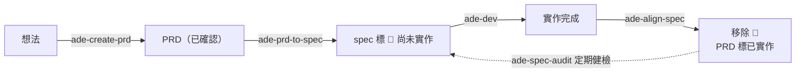

# __ADE_NAME__

> 團隊的 **Agentic Dev Environment（ADE）**：把跨服務知識、產品規格與開發方法集中成一份 repo，一行指令注入到每個人的 Claude Code，讓全隊的 agent 用同一套上下文、同一套做事流程。

## 這是在解決什麼

我們有多個服務、多個 repo。每次要 agent 幫忙，都得重講一次「我們有哪些服務」「這功能的規格長怎樣」「我們的 commit 和 MR 怎麼寫」——講過的下次還要再講，而且每個人講的版本都不太一樣；文件寫了也沒人維護，半年後沒人敢信。

ADE 把這兩件事抽出來共用：

- **知識**（`knowledge/`）— 服務 registry、跨服務流程慣例、產品規格與 PRD。agent 需要時自己去讀，不用人轉述。
- **方法**（`skills/`）— 十五支 `ade-*` skill，把「我們怎麼開需求、怎麼開發、怎麼交付、怎麼維護文件」寫成 agent 照著跑的流程。

再加一條讓它不會腐爛的機制：工作目錄裡的知識是**唯讀副本**，agent 用的過程中發現內容與現實不符，會**當場開 PR 修回來**，人只需要 review。

| 角色 | 用它做什麼 |
| --- | --- |
| **PO** | 把模糊想法問成標準 PRD、落進產品規格，並確認規格與實作沒有走鐘 |
| **RD** | 從工作目錄開 session，agent 自己定位服務、clone repo、照六關流程開發、發 MR |
| **全員** | 發現知識過期就地回流，不必等誰來維護文件 |

**導覽**：[初始設定](#初始設定建-repo-後做一次) · [快速上手](#快速上手) · [核心概念](#核心概念) · [常用場景速查](#常用場景速查) · [Skills](#skills) · [本 repo 結構](#本-repo-結構) · [維護原則](#維護原則)

---

## 初始設定（建 repo 後做一次）

1. 填 `package.json` 的 `repository.url`——放 GitHub／GitLab 填 git url；**只在本地**填絕對路徑（見[本地模式](#本地模式ade-repo-不放-githubgitlab)）
2. `git add -A && git commit`（init／update 都從 commit 取內容，沒有 commit 會被擋下），放 GitHub／GitLab 的再 push
3. 開始填 `knowledge/`：在本 repo 開 Claude Code 說「新增服務」（`ade-add-service`），或手填 `knowledge/services/_template.yaml` 格式並更新 `services/index.md`

---

## 快速上手

### 先認識兩個地方

整套機制只有兩個位置，先分清楚，後面都好懂：

| | 是什麼 | 誰在動它 |
| --- | --- | --- |
| **ADE repo**（就是本 repo） | 團隊知識與 skills 的**唯一真相來源**，全隊共用一份。 | 一律走 PR（agent 端由 `ade-contribute` 引導）；[本地模式](#本地模式ade-repo-不放-githubgitlab)沒有 PR，在本 repo 內直接 commit、或由人 merge 回流分支 |
| **工作目錄**（hub） | 你自己電腦上的一個資料夾，是**開 Claude Code 的起點**。裡面有一份 ADE 的唯讀副本＋全部 skills，底下的 `workspaces/` 放實際要開發的服務 repo。 | 副本不要手改（update 會整個覆蓋）；`workspaces/` 下的服務 repo 照平常方式開發 |

### 步驟 1：設定 SSH（只做一次）

init／update 透過 SSH 存取本 repo。先驗證：

```sh
ssh -T git@github.com   # GitLab 則為 git@gitlab.com；出現歡迎訊息即可跳過以下步驟
```

尚未設定金鑰：

```sh
ssh-keygen -t ed25519 -C "you@company.com"   # 一路 Enter 即可
cat ~/.ssh/id_ed25519.pub                     # 複製輸出，貼到 GitHub／GitLab 帳號設定的 SSH Keys
ssh -T git@github.com                         # 再次驗證
```

### 步驟 2：挑一個目錄，執行 init

自己找一個空目錄當工作目錄（例如 `~/ade-hub`，名字隨意，**一台機器一個就夠**），`cd` 進去執行：

```sh
mkdir -p ~/ade-hub && cd ~/ade-hub
pnpm dlx "git+ssh://git@github.com/ORG/__ADE_NAME__.git" init
```

init 在**當前目錄**建立以下內容，既有檔案不會被覆蓋：

| 產出 | 說明 |
| --- | --- |
| `CLAUDE.md` 的 `<!-- ADE:BEGIN/END -->` 區段 | ADE 給 agent 的常駐指引；區段外你原有的內容不動 |
| `.claude/ade/knowledge/` | 知識庫副本 |
| `.claude/skills/ade-*/` | 全部 ade-* skills |
| `workspaces/` | 開發作業區，agent 之後把服務 repo clone 到這裡；自動加入 `.gitignore` |
| `.ade.json` | 設定檔：`source`（來源 repo）、`commit`（目前知識版本）、`workspaces`（作業區實際位置，預設 `null`＝就在目錄底下） |

裝完長這樣：

```
~/ade-hub/                    ← 工作目錄（hub）：Claude Code 一律從這裡開
├── CLAUDE.md                 ← 你自己的指引 ＋ ADE managed 區段
├── .ade.json                 ← ADE 設定：來源、版本、workspaces 位置
├── .claude/
│   ├── ade/knowledge/        ← 知識庫唯讀副本（update 會整個覆蓋）
│   └── skills/ade-*/         ← ade-* skills（同上）
└── workspaces/               ← 開發用的 repo 都 clone 到這裡
    ├── service-a/
    ├── service-b/
    └── __ADE_NAME__/         ← 要改知識庫時，本 repo 的工作副本也放這
```

> [!IMPORTANT]
> **session 一律從工作目錄根開啟。** 在 `workspaces/<service>/` 裡直接開 Claude Code 會載不到 ade skills 與知識庫；需要哪個服務，讓 agent 自己進去。

> public repo 可用短寫法 `pnpm dlx github:ORG/__ADE_NAME__ init`；private repo 走 `github:` 會因 tarball API 無認證而失敗，**請一律用上方 git+ssh 形式**。

### 步驟 3（選用）：沿用你既有的 repo 資料夾

已經有固定放 repo 的地方（例如 `~/projects`），不必搬家、也不用重 clone——把它指給 init：

```sh
pnpm dlx "git+ssh://git@github.com/ORG/__ADE_NAME__.git" init --workspaces ~/projects
```

`workspaces/` 會建成該資料夾的 symlink：`cd workspaces` 就到 `~/projects`，底下已下載的 repo 直接沿用。實際位置記在 `.ade.json` 的 `workspaces`，事後改這個欄位再跑一次 update 即可重建 symlink。

### 步驟 4：日後更新

同一行指令把 `init` 換成 `update`，就會拉到最新的知識與 skills：

```sh
cd ~/ade-hub
pnpm dlx "git+ssh://git@github.com/ORG/__ADE_NAME__.git" update
```

update 直接 clone 最新版，不受 dlx 快取影響。

### 本地模式：ADE repo 不放 GitHub／GitLab

ADE repo 只是本機（或共用磁碟）上的一個 git repo 也能用。步驟 1 跳過，步驟 2／4 的指令換成 `file:` 形式：

```sh
# 一次性：package.json 的 repository.url 填絕對路徑，commit，然後在工作目錄
pnpm dlx "file:/Users/me/__ADE_NAME__" init      # update 同形式；file: 必要，直接給目錄會找不到相依
```

之後的迭代迴圈有兩條路，**日常以 A 為主**：

- **A. 直接在本 repo 開 Claude Code** — `ade-add-service`／`ade-create-prd`／`ade-prd-to-spec`／`ade-add-skill`／`ade-add-process` 等八支 skill 都能用，改完 commit 到 main 即可，不需要分支或 PR
- **B. 從工作目錄回流** — 開發服務時 agent 發現知識過期，`ade-contribute` 會 clone 到 `workspaces/__ADE_NAME__/`、開分支、push 回本 repo 並回報分支名；你回到本 repo `git merge` 即可（沒有 issue／PR）

兩條路收尾都一樣：回工作目錄說「更新 ADE」。session 開始的新鮮度檢查（`git ls-remote <路徑> HEAD`）會自動提醒落後。

三件要知道的：

- **先 commit**：init／update 都從 commit 取內容，create 完沒 commit 會被擋下（不會留殘局）
- **本 repo 停在 main**：`update` 取的是本 repo 當下 checked-out 的 HEAD；在分支上工作時先不要 update，merge 回 main 再更新
- **機制改良沒有 issue 可開**：各流程沉澱出的 `[upstream-candidate]` 改為 append 到根目錄 `UPSTREAM-CANDIDATES.md`，`ade-feedback-upstream` 從那裡收

### 裝好之後，先記這兩支 skill

- **`/ade-help`** — 「有哪些 skill 可以用？」問它就對了。它即時掃描當前位置真正載得到的 `ade-*` skills 並列出用途，不會像文件一樣過期。下面的 [Skills](#skills) 表是逐支詳解，`/ade-help` 是隨手可查的目錄。
- **`/ade-update`** — 步驟 4 的自動版。說「更新 ADE」，它會先比對版本（一樣就不跑）、提醒手改過的 managed 內容先走 `ade-contribute` 回流（否則被覆蓋），更新完回報版本變化與這期間新增的 skill——**新 skill 就是這樣進到你的工作目錄的**。session 開始偵測到落後時也會主動提醒。

---

## 核心概念

### 1. 知識單向流出，修改單向流回

```
  ADE repo  ──── init / update ────▶  工作目錄的唯讀副本  ────▶  agent 讀取使用
     ▲                                                              │
     └──────────  PR（ade-contribute 引導） ◀───────────  發現過期 / 要新增
```

副本永遠會被 update 整個覆蓋，所以**直接改 `.claude/ade/` 等於白改**。這不是限制，而是保證：每個人手上的知識一定是同一份，任何修改都經過 PR 這道 review 閘門。`ade-contribute` 的存在就是把「想改知識」自動導向正確位置——它會在 `workspaces/<ade-repo-name>/` 開分支、改檔、開 PR。

### 2. 只收三類知識

寫進 ADE 的東西要能通過這關（完整規則見 [`knowledge/README.md`](knowledge/README.md)，那份是 canonical）：

| 收 | 為什麼 |
| --- | --- |
| **跨服務知識** | 單一服務無法自述的：服務定位、服務間依賴、跨服務流程與團隊慣例 |
| **取得服務的最小資訊** | agent 進 repo 之前必需的：repo URL、預設分支、技術棧概要 |
| **產品規格與需求** | `specs/` 與 `prd/`，包含單一服務就能完成的功能——spec 的讀者是 PO |

**不收**：服務內部的規範、架構細節、安裝啟動測試步驟——那些歸服務自己的 `CLAUDE.md` / `AGENTS.md` / code，clone 下來就有，ADE 不複製一份會過期的副本。

### 3. 產品規格 ≠ 實作規格

兩個詞在 ADE 有嚴格分工，混用會出事（完整詞彙表見 [`CONTEXT.md`](CONTEXT.md)）：

- **產品規格（Spec）**— `knowledge/specs/` 的長期資產，描述產品**當前**的整體功能，由 PO 持續迭代。
- **實作規格**— 一次開發的產出，只描述該次範圍，活在工作目錄，簽核後**凍結**。事後同步產品規格時**以實作結果為準**，不以它為準。

產品規格同時承載「已上線的現況」與「已定案未開發」兩種資訊，靠 `🚧 尚未實作（PRD: …）` 標記區分——所以讀 spec 的人永遠知道哪些行為現在真的存在。

### 4. 需求的完整生命週期



1. **PO** 用 `ade-create-prd` 把想法問成 PRD（含 Discovery 與盲點拷問），定案後標「已確認」
2. **PO** 用 `ade-prd-to-spec` 把 PRD 融入 `specs/`，新行為標 `🚧`，逐項確認對齊
3. **RD** 在工作目錄走 `ade-dev` 六關開發，`ade-ship` 發 MR
4. **RD** 開發完跑 `ade-align-spec`：核對實作、移除 🚧、PRD 標「已實作」，開 PR 回本 repo
5. 虛線那條是補漏：hotfix 與直接改 code 不會經過上面四步，`ade-spec-audit` 定期抓出這種**規格漂移**

步驟 1、2 在本 repo 或工作目錄都能跑——在工作目錄時走 `ade-contribute`，改的是 `workspaces/` 下的工作副本，最後開 PR。

### 5. Context 是最稀缺的資源

這是貫穿 ADE 一切設計的底層原則：每份文件都要回答「這段內容值得在什麼時機、以什麼成本進入 context？」

- **常駐最小**：`CLAUDE.md` managed 區段只寫「何時做＋去哪看」，一條一行
- **按需載入**：細節分檔存放，skill body 精簡、超過一頁的細節拆出去引用
- **導航短、細節深**：`services/index.md` 只給一兩行定位，細節在各自的 yaml

新增任何常駐規則前都要先過這一關——這也是為什麼 ADE 的知識不是「把所有文件都塞進去」。

---

## 常用場景速查

在工作目錄開 Claude Code，直接用自然語言說就會觸發對應 skill：

| 你想做的事 | 說一句 | 觸發 |
| --- | --- | --- |
| 看看現在有哪些 skill 可用 | 「有哪些 skill」 | `ade-help` |
| 拿到最新知識與新 skill | 「更新 ADE」 | `ade-update` |
| 知道我們有哪些服務 | 「列出服務」 | `ade-list-service` |
| 把新服務加進知識庫 | 「新增服務」 | `ade-add-service` |
| 把一個想法整理成需求文件 | 「建 PRD」 | `ade-create-prd` |
| 把定案的 PRD 落進規格 | 「PRD 轉 spec」 | `ade-prd-to-spec` |
| 開始開發一個需求 | 「開始開發」／「繼續開發」 | `ade-dev` |
| 一次把好幾個任務跑完 | 「批次開發」 | `ade-dev-auto` |
| 交付：commit 與發 MR | 「commit」／「發 MR」 | `ade-commit`／`ade-ship` |
| 開發完成，文件收尾 | 「對齊 spec」 | `ade-align-spec` |
| 懷疑規格跟現況對不上 | 「規格還對嗎」 | `ade-spec-audit` |
| 發現 ADE 的知識有錯或缺漏 | 「把這個記回知識庫」 | `ade-contribute` |
| 想把某個做法定成團隊慣例 | 「以後都這樣做」 | `ade-add-process` |
| 想把某個流程做成 skill | 「新增 skill」 | `ade-add-skill` |

---

## Skills

### 注入工作目錄的 skills（init 後在工作目錄可用）

「本 repo」欄標 ✅ 者在本 ADE repo 內也可用（`.claude/skills/` 有 symlink，單一真相在 `skills/`）。

| Skill | 用途 | 本 repo |
| --- | --- | --- |
| **`ade-help`** | 列出當前位置可用的 ade-* skills 與各自用途（「有哪些 skill」「ADE 支援什麼」）。清單由 `list-skills.sh` 掃 `.claude/skills/ade-*/SKILL.md` 的 frontmatter 即時產生——**不寫死清單**，skill 搬家或新增都不用回頭改；掃的是當前位置真正載得到的目錄，工作目錄與 ADE repo 自然列出各自那套。 | ✅ |
| **`ade-update`** | 把工作目錄的 managed 內容拉到本 repo 最新版（「更新 ADE」，或 session 開始偵測到落後時）。先用 `git ls-remote` 比對 `.ade.json` 的 `commit`（一樣就不跑）、提醒把 managed 區域的手改先走 `ade-contribute` 回流，才執行 `pnpm dlx <source> update`，最後回報版本變化與期間新增的 skill。**只在消費端工作目錄用**——本 repo 內沒有 managed 副本，用一般 `git pull`。 | — |
| **`ade-contribute`** | 從工作目錄修改本知識庫的**唯一通道**（「改 ADE 的 spec／skill」「回流」）。主動撰寫直接建分支開工；被動回流先查 open issues／PRs 避免重複，沒有才開 issue 記錄缺口、PR 再連回該 issue。工作副本放 `workspaces/<ade-repo-name>/`，已存在就重用、收尾切回主幹，人只需 review PR。本地模式（`source` 是路徑）沒有 issue／PR：push 分支交人 merge。**絕不直接改工作目錄的 `.claude/ade/` 副本**——那是 managed 區域，update 時會被覆蓋。其他 skill 的「開 PR」動作都委派給它。 | — |
| **`ade-add-service`** | 在知識庫註冊新服務（「新增服務」）。依 `knowledge/services/_template.yaml` 建描述檔（`repo` 的 url 與 branch 必填，agent 之後要靠它自主 clone），並同步 `services/index.md` 總覽表。資訊不足會問人，不留空猜測。在本 repo 直接編輯收尾，在工作目錄則走 `ade-contribute`。 | ✅ |
| **`ade-list-service`** | 列出目前所有已註冊的服務（「有哪些服務」）。讀 `services/index.md` 並與目錄下的描述檔比對，回報清單與兩者不一致處。只讀不改。 | ✅ |
| **`ade-create-prd`** | 引導 PO 產出標準化 PRD（「建 PRD」），涵蓋「只有模糊想法」到「照範本填寫」兩種起點。想法未成形先跑 **Discovery** 7 題（一批 2–3 題，已有答案的跳過），接著對照服務總覽、既有 spec 與進行中 PRD 用團隊詞彙寫入 `knowledge/prd/`，再進**盲點拷問**（邊界與錯誤情境、跨服務影響、權限安全、資料相容性、驗收可測性、相鄰功能），最後用 `validate-prd.sh` 機械檢查。**不自動翻狀態**——留「草稿」，PO 確認才改「已確認」。 | ✅ |
| **`ade-prd-to-spec`** | 把已確認的 PRD 落入規格（「PRD 轉 spec」）。找出受影響的 spec（必要時新建），將需求寫成「功能完成後應有的樣子」，並在每個新增／變更的行為區塊上方加 `🚧 尚未實作（PRD: …）`——spec 因此同時承載「已上線現況」與「已定案未開發」，靠標記區分。完成後回填 PRD 的「Spec 異動摘要」，帶 PO 逐項確認。產出即 RD 開發時的規格依據。 | ✅ |
| **`ade-dev`** | 判準制標準開發流程（「開始開發」「繼續開發」）。六關：規格（實作規格，人簽核後凍結）→ 規劃（Phase 地圖）→ 實作（逐 Phase 輪到才展開，TDD 紅→綠，交前兩軸審查）→ 測試審視 → 沉澱 → Ship。每關只定義產出與過關判準，不規定做法；狀態全在 `.ade-dev/`，session 可隨時 `/clear` 換手。內建 **Spec Ready gate G1–G8 與 auto-pilot 模式**，配零容忍煞車與有限重試。規則全在 `knowledge/process/ade-dev-workflow/`，skill 只是指標。 | — |
| **`ade-dev-auto`** | 串接多個 ade-dev 任務的批次執行器（「批次開發」）。列出 `.ade-dev/` 下未完成任務供多選，逐顆跑 Spec Ready 判定，不合格的問人補齊或剔除，全數就緒後依序 auto-pilot 執行。只定義批次層 B1–B4 與批次熔斷，任務內判準全在 ade-dev。 | — |
| **`ade-ship`** | 從服務 repo 分支發出 MR／PR（「發 MR」「ship」），也是 ade-dev 第 6 關與 ade-dev-auto 的交付通道。偵測平台（GitHub → `gh`、GitLab → `glab`，退 API）、專案自有範本優先（GitHub 六個位置＋組織預設、GitLab 設定層與 `.gitlab/merge_request_templates/`）、沒有就用內建 `templates/mr.md`，依實際 diff 填寫後發出並回報 URL。不自動 merge。 | — |
| **`ade-commit`** | commit 訊息慣例解析，任何要在服務 repo commit 的場景使用。依序找專案自述（CLAUDE.md／AGENTS.md／CONTRIBUTING）→ commitlint 等設定檔 → 既有 git log 風格 → 都沒有才用 ADE 預設（`knowledge/process/git-commit.md`，Conventional Commits）。一個 commit 一件事。 | — |
| **`ade-align-spec`** | 開發收尾的文件對齊（「開發完了更新 spec」）。對照實際實作逐一核對該 PRD 的 `🚧 尚未實作` 標記：做完且一致的移除、有出入的**以實作為準**改 spec 並記差異、沒做的保留；驗收項全完成時 PRD 轉「已實作」。最後開 PR 把差異清單交 PO 判斷。只動屬於這次 PRD 的標記。 | — |
| **`ade-spec-audit`** | spec 的定期健檢（「規格還對嗎」）。PRD 流程只覆蓋計畫內開發，hotfix 與直接改 code 會讓 spec 悄悄失真——這支補上偵測路徑：逐份 spec 對照實作（缺的 repo 會先 clone），找出行為已變／功能已移除／實作有但 spec 沒記載的漂移，產出清單讓人決定修 spec 還是修 code，確認後開 PR。建議 release 後或定期執行。 | — |
| **`ade-add-skill`** | 新增 skill 的 meta-skill（「把這個做成 skill」）。先問使用對象再決定位置：消費端工作目錄用 → `skills/ade-*`（init/update 注入）；本 repo 內用 → `.claude/skills/ade-*`；兩邊都用 → 放 `skills/` 加 symlink。並落實 `ade-` 命名規則、context 紀律與 README 同步。 | ✅ |
| **`ade-add-process`** | 建立或修改流程慣例的 meta-skill（「以後都這樣做」）。依三層機制選載體：無條件約束 → `claude-md/section.md` 加一行指標；有觸發時機的程序 → 新增一支 `ade-` 前綴 skill；細節 → `process/` 一主題一檔。並執行 context 紀律：常駐層只寫「何時做＋去哪看」，常駐規則超過 10 行時新增前必須與使用者確認取捨。 | ✅ |

### 在本 ADE repo 內工作用的 skills（PO／維護者在本 repo 開 Claude Code 使用）

| Skill | 用途 |
| --- | --- |
| **`ade-feedback-upstream`** | 把本 repo 演化出的**機制**改良（更好的 skill 寫法、模板結構、流程設計）以 **issue** 回饋給上游 create-agentic-dev-env 框架，由上游維護者決定是否採納，讓所有 ADE repo 受益。改良來源除了日常觀察，也包括本 repo 標題前綴 `[upstream-candidate]` 的 issues（各流程收尾沉澱時經 `ade-contribute` 開出）。鐵律：只回饋機制、**絕不回饋內容**——`knowledge/` 下的公司知識、服務資訊、規格全屬機密，送出前逐行檢查 issue 內文、把公司語彙抽換成通用範例。上游位址記在 `package.json` 的 `ade.upstream`。 |

---

## 本 repo 結構

```
knowledge/
├── README.md    # 知識分層規則（canonical）
├── services/    # 服務 registry：index.md 總覽導航 + 一服務一檔 yaml
├── process/     # 跨服務流程與團隊級慣例（含 ade-dev-workflow/ 開發流程規則）
├── specs/       # 產品規格，持續迭代的真相來源；GLOSSARY.md 是產品域詞彙
└── prd/         # 一次開發一檔的需求文件，歷史文件不迭代
skills/          # init 時注入工作目錄的 .claude/skills/（十五支，見上方 Skills）
.claude/skills/  # 在本 repo 內工作用的 skills（ade-feedback-upstream ＋ 七支的 symlink）
claude-md/       # CLAUDE.md managed 區段的內容
CONTEXT.md       # ADE 開發流程的統一詞彙表
UPSTREAM-CANDIDATES.md  # 本地模式下 [upstream-candidate] 的落點（有 issue tracker 時留空）
```

## 維護原則

- **副本唯讀**：工作目錄裡的 ADE 內容 update 會覆蓋，所有修改都回到本 repo 走 PR——agent 端由 `ade-contribute` 引導完成
- **分層有界**：本 repo 只收跨服務知識、取得服務的最小資訊、產品規格三類，完整規則以 [`knowledge/README.md`](knowledge/README.md) 為準
- **機制回饋、內容不外流**：使用中演化出的**機制**改良（skill 寫法、模板、流程）用 `ade-feedback-upstream` 回饋給 [create-agentic-dev-env](https://github.com/franKobayasi/agentic-dev-env) 上游；`knowledge/` 下的公司知識絕不外流
